### Olá! Eu sou o Lucas Carvalho! 👋
#### Bem-vindo ao meu perfil!

💻 Sou desenvolvedor de software com foco em **Back-end**.  
🚀 Estou iniciando minha carreira e sempre em busca de novos desafios e aprendizados. Sou uma pessoa dedicada, curiosa e apaixonada por resolver problemas através da tecnologia.

#### É importante...
...dizer que aqui no meu GitHub estou documentando minha jornada de evolução como desenvolvedor.  
Espero que você goste de estar aqui! :)

  

#### &#128295; Tecnologias:

- **Back-End:**    

- **Front-End:**    

- **Bancos de Dados:**  

- **DevOps & Ferramentas:** 
 

- **Testes:**   

#### 🎓 Formação:
- **Análise e Desenvolvimento de Sistemas**

#### 🚀 Projetos em Destaque:

**📝 [To-Do List](https://github.com/LucasCarvalhoo/todo-list)**  
Aplicação de lista de tarefas com **Angular e PostgreSQL**. Sistema completo de CRUD com autenticação JWT.

**🔥 [CRUD Java + Angular](https://github.com/LucasCarvalhoo/crud-java-angular)**  
Sistema **full stack** de gerenciamento de usuários com **Spring Boot** e **Angular**. Arquitetura RESTful e boas práticas.

**🔢 [Calculadora de IMC](https://github.com/LucasCarvalhoo/caculadora-imc)**  
Calculadora responsiva de Índice de Massa Corporal com classificação automática.

**✅ [Testes Automatizados com Cypress](https://github.com/LucasCarvalhoo/cypress-basico-v2)**  
Automação de testes E2E com **Cypress** e integração CI/CD.

#### ✍🏻 Me encontre aqui:

#### 💡 Atualmente estudando:
- Arquitetura de software e microserviços
- Segurança em aplicações web
- CI/CD e DevOps

---

💬 **"Em busca de contribuir em projetos desafiadores e crescer profissionalmente em equipes que valorizam inovação e colaboração."**<!-- Última atualização: Fri Sep 26 12:17:47 UTC 2025 -->
<!-- Última atualização: Fri Sep 26 12:18:41 UTC 2025 -->
<!-- Última atualização: Fri Sep 26 12:21:05 UTC 2025 -->
